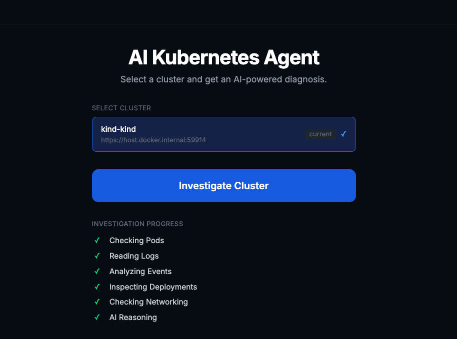
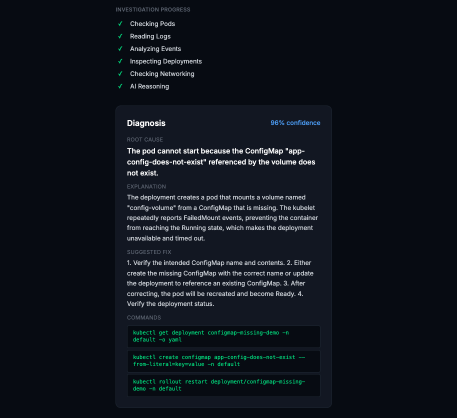
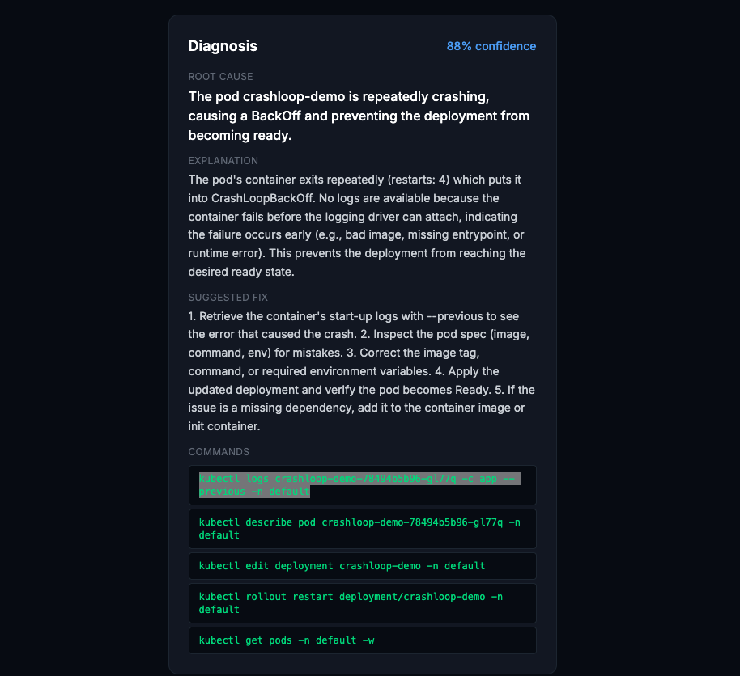

# AI Kubernetes Agent

On-demand Kubernetes troubleshooting powered by AI. Select a cluster, click investigate, and get a root-cause diagnosis with actionable fix commands in seconds.



## How It Works

The agent inspects your cluster across five dimensions, then sends the findings to an LLM for root-cause analysis:

```
Frontend (Next.js)
    ↓
FastAPI Backend (Orchestrator)
    ↓  Checking Pods · Reading Logs · Analyzing Events
    ↓  Inspecting Deployments · Checking Networking
Kubernetes Investigation Layer
    ↓
AI Agent (OpenRouter)
    ↓
Root Cause + Explanation + Suggested Fix + kubectl Commands
```

## Example Diagnoses

**Missing ConfigMap** — 96% confidence



**CrashLoopBackOff** — 88% confidence



## Quick Start

```bash
# 1. Copy env files
cp backend/.env.example backend/.env
cp frontend/.env.example frontend/.env.local

# 2. Fill in backend/.env
#    OPENROUTER_API_KEY=<your key>
#    OPENROUTER_MODEL=<model id, e.g. openai/gpt-4o-mini>

# 3. Run everything
docker compose up --build
```

- Frontend: http://localhost:3000
- Backend API: http://localhost:8000
- Health check: http://localhost:8000/health

> **Docker + kind/minikube**: The backend rewrites `127.0.0.1` → `host.docker.internal` in the kubeconfig automatically, so local clusters work out of the box.

## Project Structure

```
ai-kubernetes-agent/
├── backend/
│   ├── api/            # Route handlers
│   ├── core/           # Config, logging
│   ├── kubernetes/     # Cluster inspection (pods, logs, events, deployments, network)
│   ├── ai/             # LLM client, prompt builder, root-cause analyzer
│   ├── services/       # Investigation orchestration
│   ├── models/         # Pydantic schemas
│   └── main.py
├── frontend/
│   ├── app/            # Next.js app router
│   ├── components/     # UI components
│   ├── services/       # API client
│   ├── hooks/          # React Query hooks
│   └── types/          # TypeScript types
├── docs/               # Screenshots
├── tests/              # Test scenarios (YAML manifests)
└── docker-compose.yml
```

## Tech Stack

| Layer | Technology |
|---|---|
| Frontend | Next.js 14, TypeScript, Tailwind CSS, React Query |
| Backend | FastAPI, Python 3.12, Uvicorn, Pydantic, Loguru, HTTPX |
| AI | OpenRouter (any compatible model) |
| Storage | InsForge |
| Infrastructure | Docker, Docker Compose |

## Configuration

All configuration lives in `backend/.env` (gitignored — never committed):

| Variable | Description |
|---|---|
| `OPENROUTER_API_KEY` | Your OpenRouter API key |
| `OPENROUTER_MODEL` | Model ID, e.g. `openai/gpt-4o-mini` |
| `KUBECONFIG_PATH` | Optional: path to a specific kubeconfig file |
| `INSFORGE_URL` | InsForge project URL |
| `INSFORGE_ANON_KEY` | InsForge anon key |
